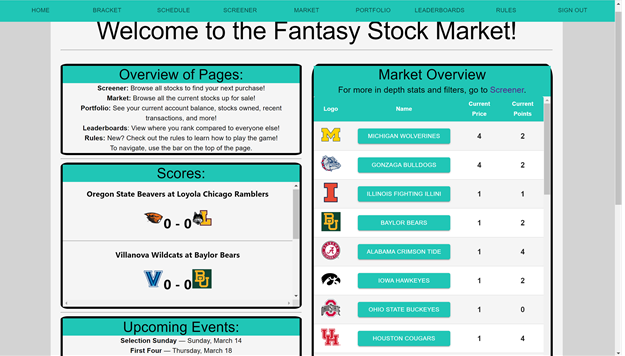
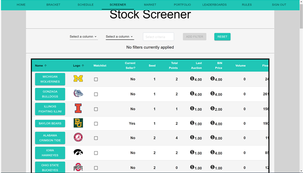
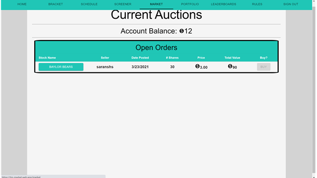
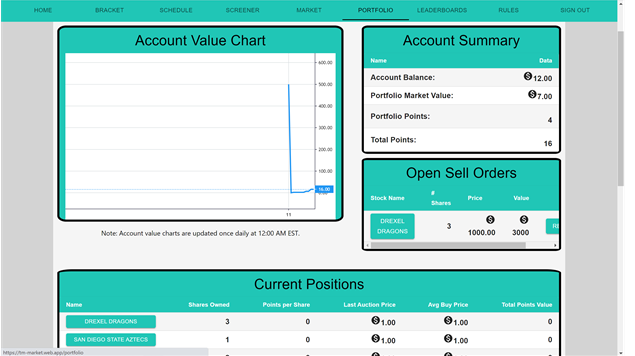
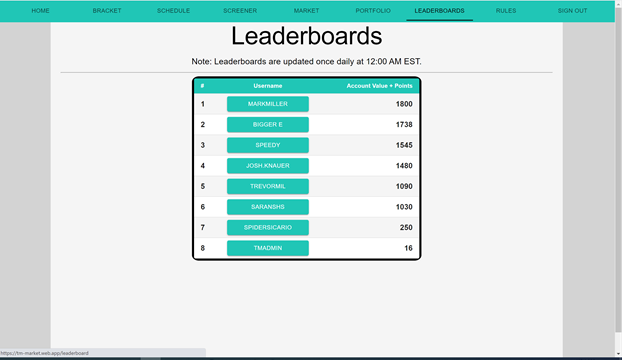

URL: https://tm-market.firebaseapp.com/

Backend API Code: https://github.com/trevormil/Fantasy-Stock-Market-API

For cryptocurrency and NFT version, check out the crypto branch.

Fantasy sports and making money are both very popular in the United States, so in this app, we combined them! This hybrid of fantasy sports with a stock market allows users to buy and sell their favorite sports teams like stocks. Everyone starts off with 500 in game coins when they create account, and with that, they can purchase their favorite teams. At the end of the season, points are tallied up based on how well the team performs throughout the season, and the user with the best portfolio wins!

Feedback and tips would be greatly appreciated!
